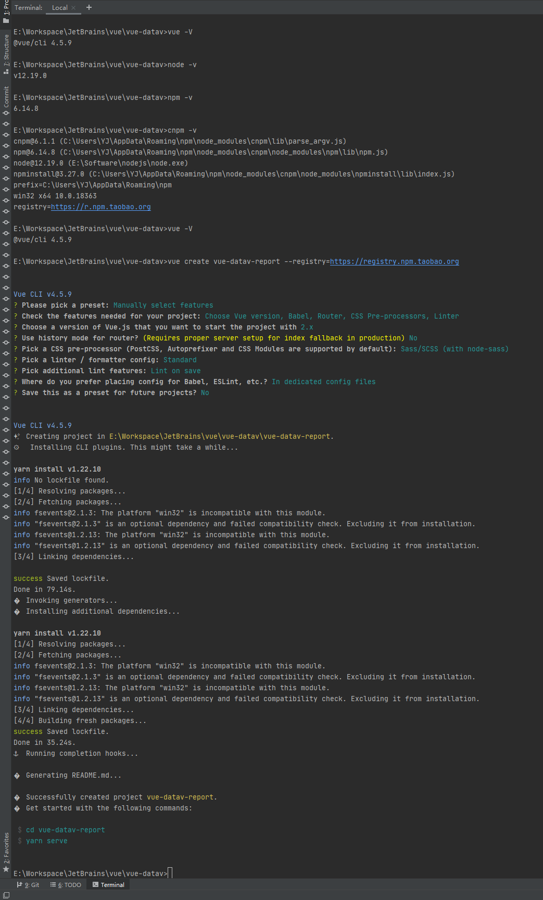

# 项目创建
* 安装 vue-cli
* 初始化项目
* 安装 vue-router
* 安装 element-ui

## 环境检查：
```shell
$ node -v # 查看node版本
$ npm -v # node 包管理器版本
$ cnpm i -g @vue/cli #安装cnpm（已安装时会执行更新操作）
$ vue -V # 创建是否已经安装vue，已经安装时，会显示版本
$ cnpm install -g @vue/cli # 安装vue；已安装会执行更新，不想更新时跳过
```
### 项目创建命令
- 通过淘宝镜像创建：
```shell script
$ vue create vue-datav-report --registry=https://registry.npm.taobao.org
```
- 创建完成后预览(这里使用了包管理器`yarn`)：
```shell script
 $ cd vue-datav-report
 $ yarn serve
```
::: tip
`yarn`包管理器初始化：
```shell script
$ yarn init
``` 
:::
- 安装element-ui
```shell script
$ cnpm i -S echarts
```
- 安装echarts
```shell script
$ cnpm i -S echarts
```
::: danger 注意：
因为`element-ui`和`echarts`是项目内使用，所在需要主页其安装位置，进入项目目录再安装。
如果刚才预览过就可以直接执行命令，没有预览请先执行：
```shell script
$ cd vue-datav-report
```

:::

::: details
```shell script
E:\workspace\vue-datav>node -v
v12.19.0
E:\workspace\vue-datav>npm -v
6.14.8
E:\workspace\vue-datav>cnpm i -g @vue/cli
...安装更新过程...
E:\workspace\vue-datav>vue -V
@vue/cli 4.5.9
E:\workspace\vue-datav>vue create vue-datav-report --registry=https://registry.npm.taobao.org
Vue CLI v4.5.9
? Please pick a preset: Manually select features
? Check the features needed for your project: Choose Vue version, Babel, Router, CSS Pre-processors, Linter
? Choose a version of Vue.js that you want to start the project with 2.x
? Use history mode for router? (Requires proper server setup for index fallback in production) No
? Pick a CSS pre-processor (PostCSS, Autoprefixer and CSS Modules are supported by default): Sass/SCSS (with node-sass)
? Pick a linter / formatter config: Standard
? Pick additional lint features: Lint on save
? Where do you prefer placing config for Babel, ESLint, etc.? In dedicated config files
? Save this as a preset for future projects? No
...下载过程
�  Successfully created project vue-datav-report.
�  Get started with the following commands:
 $ cd vue-datav-report
 $ yarn serve
 ====================
 安装element-ui
 ===================
 E:\workspace\vue-datav\vue-datav-report>vue add element --registry=https://registry.npm.taobao.org
 �  Installing vue-cli-plugin-element...
 ✔  Successfully installed plugin: vue-cli-plugin-element
 ? How do you want to import Element? Import on demand
 ? Choose the locale you want to load zh-CN
✔  Successfully invoked generator for plugin: vue-cli-plugin-element
===========
安装echarts
===========
E:\workspace\vue-datav\vue-datav-report>cnpm i -S echarts
√ Installed 1 packages
√ Linked 1 latest versions
√ Run 0 scripts
√ All packages installed (2 packages installed from npm registry, used 2s(network 2s), speed 5.46kB/s, json 2(11.81kB), tarball 0B)

```
* 完整过程


:::
