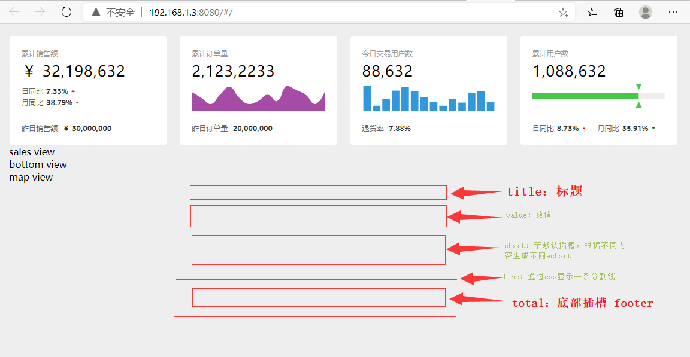

# 核心指标页面开发
## 分模块开发
> 界面分成四块，分别是顶部`ViewTop`、中间销售模块`ViewSales`、底部`ViewBottom`和地图模块`ViewMap`
## ViewTop
顶部控件模型四个排版类似，外层通过`el-card`标签，每个模块可分为`title`,`value`，`chart`，`line`，`total`，
其中`chart`和`total`四个模块中的内容不同，可以将四个模块抽取出一个公共模块，然后，四个不同内容通过插槽(`sort`)定制。
插槽使用时，将插槽内容通过`template`标签包裹。



使用 [element-ui](https://element.eleme.cn/#/zh-CN/component/installation) 中的 [Card](https://element.eleme.cn/#/zh-CN/component/card)

为了让`el-card`水平平均显示，引入 `el-row`和`el-col`:
!> 在plugins/elements.js中添加Card，Row，Col依赖
```html
<div>
    <el-row :gutter="20">
      <el-col :span="6"><el-card shadow="always">总是显示</el-card></el-col>
      <el-col :span="6"><el-card shadow="hover">鼠标悬浮时显示</el-card></el-col>
      <el-col :span="6"><el-card shadow="always">总是显示</el-card></el-col>
      <el-col :span="6"><el-card shadow="always">总是显示</el-card></el-col>
    </el-row>
</div>
```

::: tip
 el-card 默认占据一行，使用el-row，el-col控制每一个el-col包裹的el-card占据整个栅格的大小    
 `span`: element将浏览器分为24个栅格，如四个卡片就每个el-col的span为6平分整个栅格    
 `gutter`: 设置每个卡片间的间距为20px    
 `shadow`: 设置卡片阴影样式。`always`总是显示,`hover`鼠标悬浮时显示,`never`从不显示
 `body-sytle`: 如果要设置card自己的样式，通过body-style属性设置，类似style
:::
模块如下：
* 抽取的公共模块`CardCommon`
* 累计销售额`CardTotalSales`
* 累计订单量`CardTotalOrders`
* 今日用户量`CardTodayUsers`
* 累计用户量`CardTotalUsers`

### CardCommon
::: warning 注：
通过`scoped`修饰的`style`不能传递给子模块，提取的公共样式可以在下方新的不带`scoped`的style中编写。
:::
::: details 
```vue
<!-- src/components/CardCommon/index.vue -->
<template>
  <div class="card-common">
    <div class="title">{{title}}</div>
    <div class="value">{{value}}</div>
    <div class="chart"><slot></slot></div>
    <div class="line"/>
    <div class="total"><slot name="footer"></slot></div>
  </div>
</template>

<script>
    export default {
      props: {
        title: String,
        value: String
      }
    }
</script>
<!-- 本模块样式 -->
<style lang="scss" scoped>
  .title {
    font-size: 12px;
    color: #999;
  }

  .value {
    font-size: 25px;
    color: #000;
    margin-top: 5px;
    letter-spacing: 1px;
  }

  .chart {
    height: 50px;
  }

  .line {
    margin: 10px 0;
    border-top: 1px solid #eee;
  }

  .total {
    font-size: 12px;
    color: #666;
  }
</style>
<!-- 传递给子模块用的公共样式 -->
<style lang="scss">
<!-- 强调 -->
  .emphasis {
    margin-left: 5px;
    color: #333;
    font-weight: 700;
  }
  
<!-- 红色上三角 -->
  .increase {
    width: 0;
    height: 0;
    border-width: 3px;
    border-color: transparent transparent red transparent;
    border-style: solid;
    margin: 0 0 3px 5px;
  }

<!-- 绿色下三角 -->
  .decrease {
    width: 0;
    height: 0;
    border-width: 3px;
    border-color: green transparent transparent transparent;
    border-style: solid;
    margin: 3px 0 0 5px;
  }
</style>
```
:::

### mixins
四个子模块都依赖于`CardCommon`,都需要执行一批同类操作，通过mxins将操作提取，放置到`src/mixins/commonCardMixin.js`中，这样子模块只需要导入mixins即可。
```js
// mixins/commonCardMixin.js
import CardCommon from '../components/CardCommon/index'
export default {
  components: {
    CardCommon
  }
}

```

### CardTotalSales
累计销售额`CardTotalSales`模块，两个插槽中的内容均为文字，直接通过样式生成，其中上三角和下三角通过css完成，由于后面也有用到，所以样式提取到了`CardCommon`中。
::: details
```vue
<template>
  <card-common
    title="累计销售额"
    value="￥ 32,198,632"
  >
    <template>
      <div class="compare-wrapper">
        <div class="compare">
          <span>日同比</span>
          <span class="emphasis">7.33%</span>
          <div class="increase"/>
        </div>
        <div class="compare">
          <span>月同比</span>
          <span class="emphasis">38.79%</span>
          <div class="decrease"/>
        </div>
      </div>
    </template>
    <template v-slot:footer>
      <span>昨日销售额 </span>
      <span class="emphasis">￥ 30,000,000</span>
    </template>
  </card-common>
</template>

<script>
  import commonCardMixin from '../../mixins/commonCardMixin'

  export default {
    mixins: [commonCardMixin]
  }
</script>

<style lang="scss" scoped>
  .compare-wrapper {
    height: 100%;
    display: flex;
    flex-direction: column;
    justify-content: center;

    .compare {
      font-size: 12px;
      color: #666;
      margin-top: 3px;
      display: flex;
      align-items: center;
    }
  }
</style>

```
:::
::: warning
默认插槽：`<template> </template>`    
带`name`属性的插槽：`<template v-slot:footer> </template>`
:::
### CardTotalOrders
* 累计订单量`CardTotalOrders`
#### echarts使用：
- 根据id获取dom对象；
- 调用`init()`初始化并返回chart对象；
- chart对象调用setOption()设置数据；
- 原生echarts使用时，需要设置div的宽高，不然不会显示；
::: details
```html
<div id="total-order-chart" style="width:600px;height:400px;background-color: #FFF;"/>
```
```js
const chartDom = document.getElementById('total-order-chart')
const chart = this.$echarts.init(chartDom)
chart.setOption({
xAxis: {
  type: 'category', // 设置折线图
},
yAxis: {},
series: [{
  type: 'line',
  data: [620, 432, 220, 534, 790, 430, 220, 320, 
            532, 320, 834, 690, 530, 220, 620],
}]
})
```
<div id="total-order-chart" style="width:600px;height:400px;background-color: #FFF;"/>
<script type="text/javascript">
   const chartDom = document.getElementById('total-order-chart');
   const chart = echarts.init(chartDom);
   chart.setOption({
       xAxis: {
           type: 'category'
       },
       yAxis: {},
       series: [{
           type: 'line',
           data: [620, 432, 220, 534, 790, 430, 220, 320, 532, 320, 834, 690, 530, 220, 620],
       }]
   });
</script>
:::
::: tip

[`type`](https://echarts.apache.org/zh/option.html#xAxis.type)：默认为`value`,适用于连续数据，当使用value时，会将数据从小到大排列，所以需要修改为`category`;    

[`boundaryGap`](https://echarts.apache.org/zh/option.html#xAxis.boundaryGap)：默认每个Item是具有宽度的，当我们展示点的时候，第一个点左边会有留白，通过`boundaryGap`设置去除留白（boundaryGap：boolean） ；
   
填充区域：默认数据展示是绘制一条线，`series`中设置填充色可让数据区垂直方向填充颜色；   
 
[坐标轴](https://echarts.apache.org/zh/option.html#xAxis.show)：按需求只需要显示数据，在每个坐标轴中通过`show`控制是否显示坐标轴（show：boolean） ；   
 
[隐藏线](https://echarts.apache.org/zh/option.html#grid.tooltip.axisPointer.lineStyle)：设置线宽为0；
    
[隐藏点](https://echarts.apache.org/zh/option.html#geo.itemStyle.opacity)：设置点的颜色透明；    
:::
::: details 查看源码
```vue
<!-- src/components/CardTotalOrders/index.vue -->
<template>
  <card-common
    title="累计订单量"
    value="2,123,2233">
    <template>
      <div id="total-order-chart" :style="{width:'100%',height:'100%'}"/>
    </template>
    <template v-slot:footer>
      <span>昨日订单量 </span>
      <span class="emphasis">20,000,000</span>
    </template>
  </card-common>
</template>
<script>
  import commonCardMixin from '../../mixins/commonCardMixin'
  export default {
    mixins: [commonCardMixin],
    mounted () {
      const chartDom = document.getElementById('total-order-chart')
      const chart = this.$echarts.init(chartDom)
      chart.setOption({
        xAxis: {
          type: 'category', // 设置折线图
          show: false,
          boundaryGap: false // 默认图表x轴两侧会有间距，设置不添加间距
        },
        yAxis: {
          show: false // 设置坐标轴不显示
        },
        series: [{
          type: 'line',
          data: [620, 432, 220, 534, 790, 430, 220, 320, 532, 320, 834, 690, 530, 220, 620],
          areaStyle: {
            color: 'purple' // 设置填充色为紫色
          },
          lineStyle: {
            width: 0 // 设置线不可见
          },
          itemStyle: {
            opacity: 0 // 数据点（item）为全透明
          },
          smooth: true // 设置数据点更平滑展示
        }],
        grid: { // 将控件四方缩进去除
          top: 0,
          bottom: 0,
          left: 0,
          right: 0
        }
      })
    }
  }
</script>
<style scoped>
</style>
```
:::


### CardTodayUsers
* 今日用户量`CardTodayUsers`
::: details
```vue
<!-- src/components/CardTodayUsers/index.vue -->
<template>
  <card-common
    title="今日交易用户数"
    value="88,632"
  >
    <template>
      <div id="today-users-chart" :style="{width:'100%',height:'100%'}"/>
    </template>
    <template v-slot:footer>
      <span>退货率 </span>
      <span class="emphasis">7.88%</span>
    </template>
  </card-common>
</template>
<script>
  import commonCardMixin from '../../mixins/commonCardMixin'
  export default {
    mixins: [commonCardMixin],
    mounted () {
      const chartDom = document.getElementById('today-users-chart')
      const chart = this.$echarts.init(chartDom)
      chart.setOption({
        color: ['#3398DB'],
        xAxis: {
          type: 'category',
          show: false,
          data: ['00:00', '01:00', '02:00', '03:00', '04:00', '05:00', '06:00', '07:00', '08:00', '09:00', '10:00', '11:00', '12:00', '13:00'],
          barWidth: '60%' // 设置柱宽
        },
        yAxis: {
          show: false
        },
        series: [{
          type: 'bar',
          data: [410, 82, 200, 334, 390, 330, 220, 150, 82, 200, 134, 290, 330, 150]
        }],
        grid: {
          top: 0,
          bottom: 0,
          left: 0,
          right: 0
        }
      })
    }
  }
</script>
<style scoped>
</style>
```
:::
### CardTotalUsers
* 累计用户量`CardTotalUsers`
::: tip
累计用户数控件中，可以看着在同一个坐标轴中，绘制了两个水平方向的柱状图（绿色、灰色）和一个自定义图形的组（两个绿色三角），且三个数据公用同一个坐标轴。    

水平方向柱状图：使用echarts时，默认都是设置`xAxis`的type，此处的需求是水平方向的柱状图，所以在`yAxis`中设置`type:'category'`。

数据项重叠：三组数据要求每个点同一处显示，可在`series`中设置每组数据的[`stack`](https://echarts.apache.org/zh/option.html#series-bar.stack)值为同一值。

[自定义控件](https://echarts.apache.org/zh/option.html#series-custom.renderItem)：设置控件`type:'custom'`,通过`renderItem`调用回调函数设置控件。

三角形：通过`type:'path'`，然后通过iconFont的字体文件中`m`中的值作为路径绘制。注意选择字体图标时，选择具有填充的图标。

:::
::: details
```vue
<!-- src/components/CardTotalUsers/index.vue-->
<template>
  <card-common
    title="累计用户数"
    value="1,088,632">
    <template>
      <div id="total-users-chart" :style="{width:'100%',height:'100%'}"/>
    </template>
    <template v-slot:footer>
      <div class="total-user-footer">
        <span>日同比</span>
        <span class="emphasis">8.73%</span>
        <div class="increase"/>
        <span class="month">月同比</span>
        <span class="emphasis">35.91%</span>
        <div class="decrease"/>
      </div>
    </template>
  </card-common>
</template>
<script>
  import commonCardMixin from '../../mixins/commonCardMixin'
  export default {
    mixins: [commonCardMixin],
    mounted () {
      const chartDom = document.getElementById('total-users-chart')
      const chart = this.$echarts.init(chartDom)
      chart.setOption({
          xAxis: {
            type: 'value',
            show: false
          },
          yAxis: {
            type: 'category',
            show: false
          },
          series: [{
            type: 'bar',
            data: [200],
            stack: '总量',
            barWidth: 10,
            itemStyle: {
              color: '#45c946'
            }
          }, {
            type: 'bar',
            data: [250],
            stack: '总量',
            itemStyle: {
              color: '#eee'
            }
          }, {
            type: 'custom',
            data: [200],
            stack: '总量',
            renderItem: (params, api) => {
              const value = api.value(0) // 获取series中第一个元素的值即200
              const endPoint = api.coord([value, 0]) // 获取坐标点
              return {
                position: endPoint, // 绘制位置
                type: 'group', // 绘制路径，通过svg图标绘制
                children: [
                  {
                    type: 'path',
                    shape: { // 绘制形状
                      d: 'M69.87548107 254.21542956l884.24903786 0-442.12313808 530.2649695z', // svg 图标的内容
                      x: -5,
                      y: -20,
                      width: 10,
                      height: 10,
                      layout: 'cover'
                    },
                    style: { // 填充色
                      fill: '#45c946'
                    }
                  },
                  {
                    type: 'path',
                    shape: { // 绘制形状
                      d: 'M512 78.56348067L959.732278 774.76985266l-895.463532 1e-8L512 78.56348067z', // svg 图标的内容
                      x: -5,
                      y: 10,
                      width: 10,
                      height: 10,
                      layout: 'cover'
                    },
                    style: { // 填充色
                      fill: '#45c946'
                    }
                  }
                ]

              }
            }
          }],
          grid: {
            top: 0,
            bottom: 0,
            left: 0,
            right: 0
          }
        }
      )
    }
  }
</script>
<style lang="scss" scoped>
  .total-user-footer {
    display: flex;
    align-items: center; // 垂直居中
    .month {
      margin-left: 20px;
    }
  }
</style>
<svg t="1605683936245" class="icon" viewBox="0 0 1024 1024" version="1.1" xmlns="http://www.w3.org/2000/svg" p-id="9585"
     width="200" height="200">
  <path d="M512 128.4096L914.944 819.2H109.056L512 128.4096zM198.144 768h627.712L512 229.9904 198.144 768z"
        p-id="9586"></path>
</svg>
```

:::

### 代码重构：vue-echarts && v-charts
#### vue-echarts
[vue-echarts](https://github.com/ecomfe/vue-echarts/blob/master/README.zh_CN.md) Apache ECharts (incubating) 的 Vue.js 组件。
基于 [Apache ECharts (incubating)](https://echarts.apache.org/zh/index.html) v4.1.0+ 开发，依赖 [Vue.js](https://cn.vuejs.org/index.html) v2.2.6+。

::: tip

安装(安装到生产环境)：
```shell script
cnpm install echarts vue-echarts -S
```
CDN
```html
<script src="https://cdn.jsdelivr.net/npm/echarts@4.1.0/dist/echarts.js"></script>
<script src="https://cdn.jsdelivr.net/npm/vue-echarts@4.0.2"></script>
```

映射配置：
```js
<!-- src/main.js -->
import VueECharts from 'vue-echarts'
Vue.component('vue-chart', VueECharts)
```
:::
使用(在`ViewSales/index.vue`中测试)：
::: details 代码 & 图例
**图例：**

<div id="vue-chart" style="width:600px;height:250px;background-color: #FFF"/>
<script type="text/javascript">
   const vueChartDom001 = document.getElementById('vue-chart');
   const vueChart001 = echarts.init(vueChartDom001);
   vueChart001.setOption({
       xAxis: { type: 'category' },
       yAxis: {},
       series: [{
           type: 'line',
           data: [620, 432, 220, 534, 790, 430, 220, 320, 532, 320, 834, 690, 530, 220, 620],
       }]
   });
</script>

```vue
<template>
  <v-chart :options="data"></v-chart>
</template>
<script>
export default {
  data() {
    return {
      data: {
        xAxis: {
          type: 'category'
        },
        yAxis: {},
        series: [{
          type: 'line',
          data: [620, 432, 220, 534, 790, 430, 220, 320, 532,
                 320, 834, 690, 530, 220, 620],
          areaStyle: {
            color: 'purple' // 设置填充色为紫色
          }
        }]
      }
    }
  }
}
</script>
<style scoped>
</style>
```
:::
::: warning
vue-echarts 就是在原生的基础上开发，简化了步骤，使用时只需要使用插件，然后通过options绑定方法设定数据即可。
:::


#### v-charts

[v-charts](https://v-charts.js.org/#/) 是饿了么的项目。

在使用 echarts 生成图表时，经常需要做繁琐的数据类型转化、修改复杂的配置项，v-charts 的出现正是为了解决这个痛点。基于 Vue2.0 和 echarts 封装的 v-charts 图表组件，只需要统一提供一种对前后端都友好的数据格式设置简单的配置项，便可轻松生成常见的图表。

**安装：**
```shell script
cnpm i v-charts echarts -S
```
**CDN：**
```html
<script src="https://cdn.jsdelivr.net/npm/vue/dist/vue.js"></script>
<script src="https://cdn.jsdelivr.net/npm/echarts/dist/echarts.min.js"></script>
<script src="https://cdn.jsdelivr.net/npm/v-charts/lib/index.min.js"></script>
<link rel="stylesheet" href="https://cdn.jsdelivr.net/npm/v-charts/lib/style.min.css">
```
>
>使用百度地图或高德地图时需要额外引入相应的模块
>
```html
<script src="https://cdn.jsdelivr.net/npm/echarts-amap/dist/echarts-amap.min.js"></script>
<script src="https://cdn.jsdelivr.net/npm/echarts/dist/extension/bmap.min.js"></script>
```
::: details 使用示例
```js
import Vue from "vue";
import VELine from 'v-charts/lib/line.common'
Vue.component('ve-line',VELine)
```
```html
<template>
  <ve-line
    :data="data"
  />
</template>
<script>
export default {
  data() {
    return {
      data: {
        columns: ['日期', '销售额'],
        rows: [
          { '日期': '1月1日', '销售额': 123 },
          { '日期': '1月2日', '销售额': 1223 },
          { '日期': '1月3日', '销售额': 2123 },
          { '日期': '1月4日', '销售额': 4123 },
          { '日期': '1月5日', '销售额': 3123 },
          { '日期': '1月6日', '销售额': 7123 }
        ]
      }
    }
  }
}
</script>
<style scoped>
</style>
```
:::
::: warning
v-chart 是一个全新的插件，不过内部封装了很多完整子模块，需要二次学习才能继续开发。当我的只需要使用样式，不需要定制功能的时候可以使用，提高开发效率。 
:::

#### 重构代码：vue-echarts替换原生

::: warning
在vue-charts中，默认设置了chart的宽高为600px*400px，style默认为 `.echarts`。这里因为我们好几个文件都需要用到，并且宽高设置我填充所以区域，所以通过全局css设置宽高。

- 创建`src/style/index.css`；
- 添加样式：
```css
.echarts {
    width: 100%;
    height: 100%;
}
```
- 在`src/main.js`中引入:
注意：css引入一定要放在`vue-charts`之后，不然不生效。
```js
import './style/index.css'
```
:::

- 改造：（以`CardTotalOrders`为例）
    - 将`<div id="total-order-chart" :style="{width:'100%',height:'100%'}"/>` 替换为：`<vue-chart :options="getOptions()" />`;
    - 去除`mounted()`中初始化内容，通过`methond`创建`getOptions`方法，返回数据；
    
::: details 完整代码
```html
<!--components/CardTotalOrders/index.vue-->
<template>
  <card-common
    title="累计订单量"
    value="2,123,2233">
    <template>
      <vue-chart
        :options="getOptions()"
      />
    </template>
    <template v-slot:footer>
      <span>昨日订单量 </span>
      <span class="emphasis">20,000,000</span>
    </template>
  </card-common>
</template>

<script>
import commonCardMixin from '../../mixins/commonCardMixin'

export default {
  mixins: [commonCardMixin],
  mounted() {
  },
  methods: {
    getOptions: () => {
      return {
        xAxis: {
          type: 'category', // 设置折线图
          show: false,
          boundaryGap: false // 默认图表x轴两侧会有间距，设置不添加间距
        },
        yAxis: {
          show: false // 设置坐标轴不显示
        },
        series: [{
          type: 'line',
          data: [620, 432, 220, 534, 790, 430, 220, 320, 532, 320, 834, 690, 530, 220, 620],
          areaStyle: {
            color: 'purple' // 设置填充色为紫色
          },
          lineStyle: {
            width: 0 // 设置线不可见
          },
          itemStyle: {
            opacity: 0 // 数据点（item）为全透明
          },
          smooth: true // 设置数据点更平滑展示
        }],
        grid: { // 将控件四方缩进去除
          top: 0,
          bottom: 0,
          left: 0,
          right: 0
        }
      }
    }
  }
}
</script>
<style scoped>
</style>

```
:::


