# 项目创建详细
* 安装 vue-cli
* 初始化项目
* 安装 vue-router
* 安装 element-ui

> 技术选型：   
> reprot项目使用的是vue 2.0 因为使用的element-ui echarts 插件还是基于vue2.0
> > `node -v` 查看node版本    
> > `npm -v`查看npm版本    
> > 通过npm安装cnpm或者在安装过程中带上淘宝镜像    
> > `npm install -g cnpm --registry=https://registry.npm.taobao.org`
>
> vue 安装命令：`cnpm i -g @vue/cli`   
> 如果已经安装过会进行更新。     
>查看版本 ： `vue -V`    
> 创建项目：`vue create 项目名 --registry=https://registry.npm.taobao.org` 
> 多选时，空格选择/取消，Enter确认
> 安装element： `vue add element --registry=https://registry.npm.taobao.org` 中间选择按需引入、中文
> 安装 echarts: `cnpm i -S echarts` 安装时需要使用 -S安装到dependencies    
> 在main.js中将echarts可以引入到原型链上，方便后面使用    
> > import Echarts from 'echarts'   
> > Vue.prototype.$echsrts = Echarts

<details style="padding: 10px;border: #eee solid 1px">
<summary style="padding: 10px;border: #eee solid 1px">DETAIL(点击展开)</summary>
<code>  
E:\workspace\vue-datav>node -v
v12.19.0
E:\workspace\vue-datav>npm -v
6.14.8
E:\workspace\vue-datav>cnpm i -g @vue/cli
...安装更新过程...
E:\workspace\vue-datav>vue -V
@vue/cli 4.5.9
E:\workspace\vue-datav>vue create vue-datav-report --registry=https://registry.npm.taobao.org
Vue CLI v4.5.9
? Please pick a preset: <font color="green">Manually select features</font>
? Check the features needed for your project: <font color="green">Choose Vue version</font>, <font color="green">Babel</font>, <font color="green">Router</font>, <font color="green">CSS Pre-processors</font>, <font color="green">Linter</font>
? Choose a version of Vue.js that you want to start the project with <font color="green">2.x</font>
? Use history mode for router? (Requires proper server setup for index fallback in production) <font color="green">No</font>
? Pick a CSS pre-processor (PostCSS, Autoprefixer and CSS Modules are supported by default): <font color="green">Sass/SCSS (with node-sass)</font>
? Pick a linter / formatter config: <font color="green">Standard</font>
? Pick additional lint features: <font color="green">Lint on save</font>
? Where do you prefer placing config for Babel, ESLint, etc.? <font color="green">In dedicated config files</font>
? Save this as a preset for future projects? <font color="green">No</font>
...下载过程
�  Successfully created project <font color="green">vue-datav-report.</font>
�  Get started with the following commands:
 $ <font color="green">cd vue-datav-report</font>
 $ <font color="green">yarn serve</font>
 ====================
 安装element-ui
 ===================
 E:\workspace\vue-datav\vue-datav-report>vue add element --registry=https://registry.npm.taobao.org
 �  Installing vue-cli-plugin-element...
 ✔  Successfully installed plugin: <font color="green">vue-cli-plugin-element</font>
 ? How do you want to import Element? <font color="green">Import on demand</font>
 ? Choose the locale you want to load <font color="green">zh-CN</font>
✔  Successfully invoked generator for plugin: <font color="green">vue-cli-plugin-element</font>
===========
安装echarts
===========
E:\workspace\vue-datav\vue-datav-report>cnpm i -S echarts
√ Installed 1 packages
√ Linked 1 latest versions
√ Run 0 scripts
√ All packages installed (2 packages installed from npm registry, used 2s(network 2s), speed 5.46kB/s, json 2(11.81kB), tarball 0B)

</code>
</details>
* 完整过程

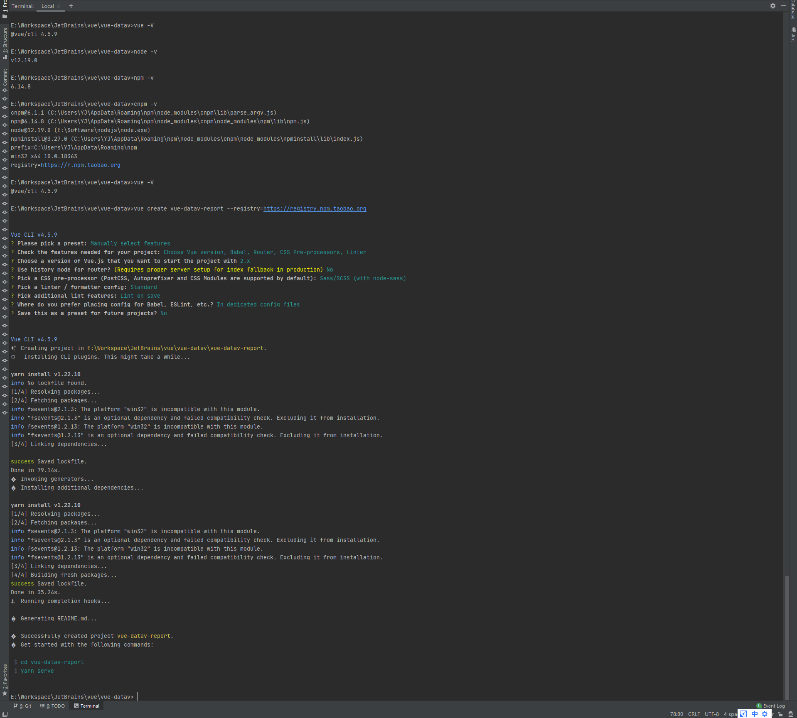

* 检查工具版本

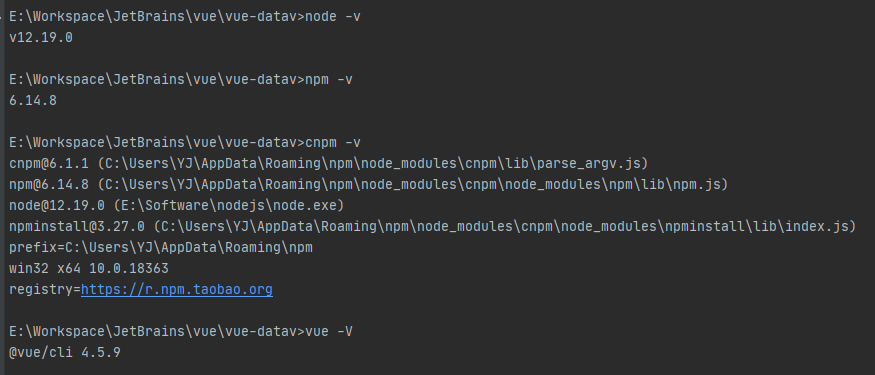

> TIPS
> 
> 创建项目：`vue create vue-datav-report --registry=https://registry.npm.taobao.org`

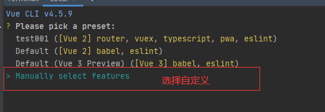

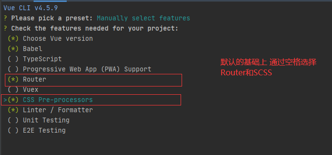

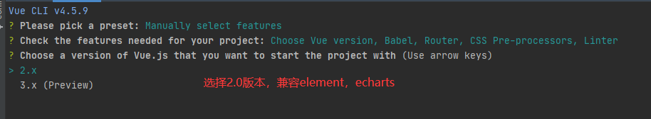

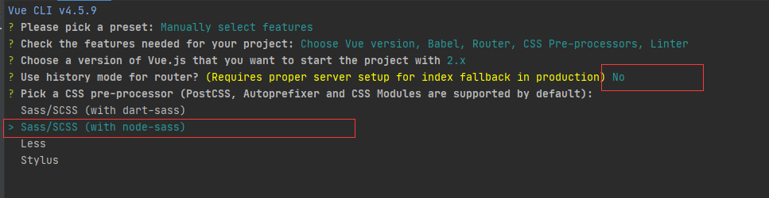

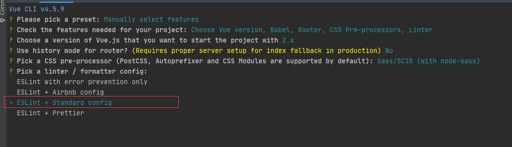

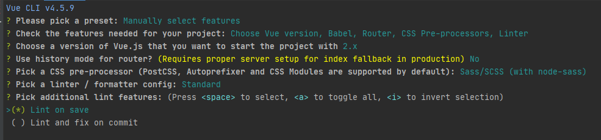

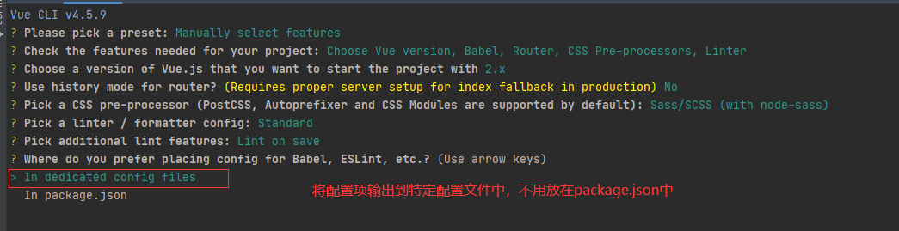

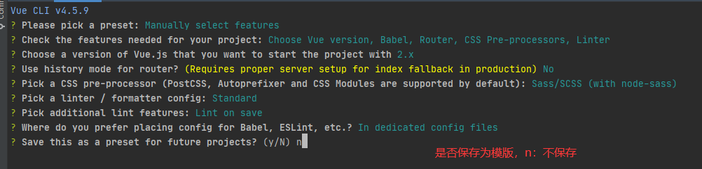

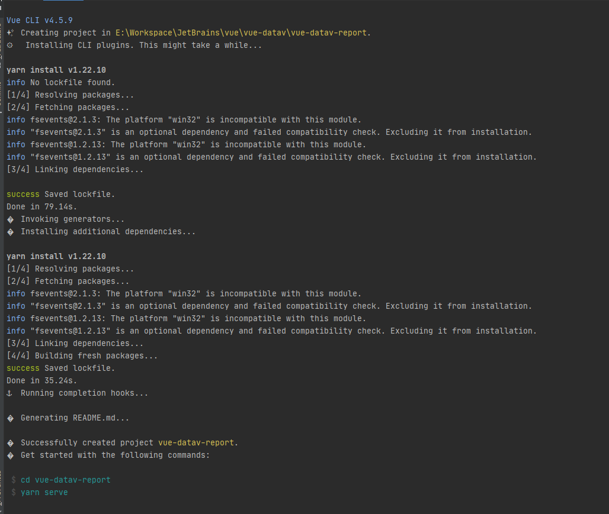

## 安装element
> TIPS
>
> 指令：`vue add element --registry=https://registry.npm.taobao.org`
> 截图有个错误：
> > 要将element安装到之前创建的vue项目中，需要进入该项目。假如刚才运行过项目，不用退回目录。    
> > 完整命令(多一层vue-datav-report目录)：  
> > `E:\...\vue\vue-datav>vue-datav-report>vue add element --registry=https://registry.npm.taobao.org
` 

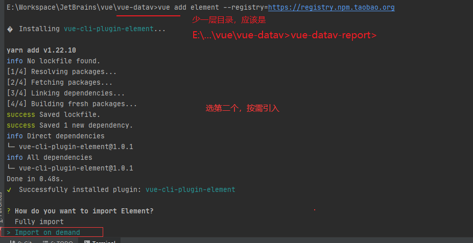
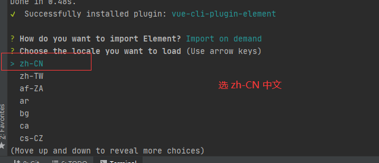
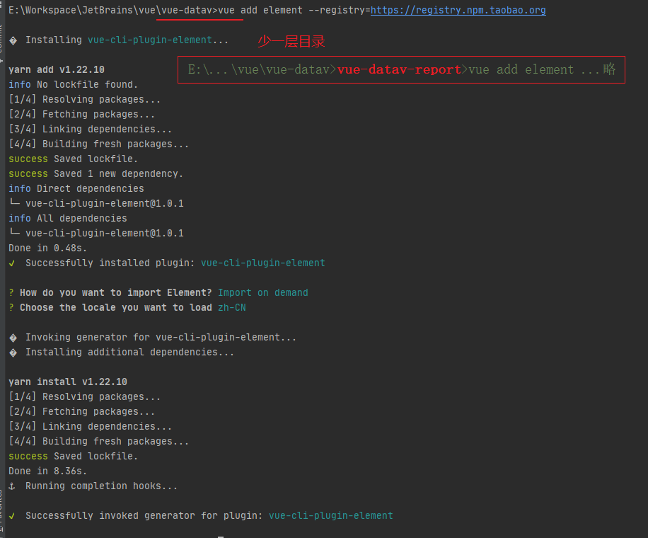

### element-ui 使用
> 在vue项目目录下的 `plugins/element.js`中按需引入需要的标签

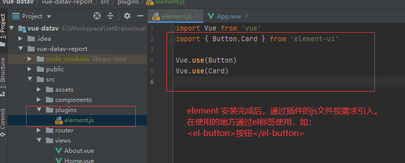

## 安装 echarts
> 安装命令：   
> `cnpm i -S echarts`

### echarts使用
```javascript
//挂载到 js 原型链上
import ECharts from 'echarts'
Vue.prototype.$echarts  = ECharts;

//使用
// this.$echarts ...
```
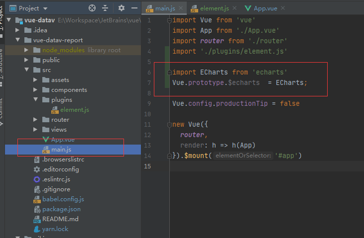
 