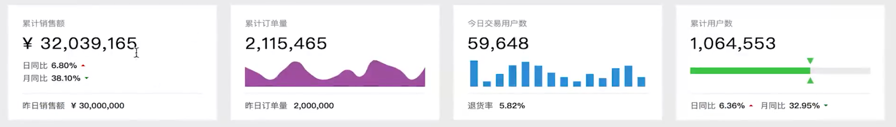

# 核心指标页面开发
## 分模块开发<!--{docsify-ignore}-->
> 界面分成四块，分别是顶部`ViewTop`、中间销售模块`ViewSales`、底部`ViewBottom`和地图模块`ViewMap`  
<details style="padding: 10px;border: #eee solid 1px">
<summary style="padding: 10px;border: #eee solid 1px">DETAIL(点击展开)</summary>
<ol>
    <li>在components中创建模块</li>
    <li>在views/Home.vue中引入</li>
</ol>


</details>

## ViewTop


使用[element-ui](https://element.eleme.cn/#/zh-CN/component/installation)中的[Card](https://element.eleme.cn/#/zh-CN/component/card)包装我们顶部

!> 在plugins/elements.js中添加Card，Row，Col依赖
```html
<div>
    <el-row :gutter="20">
      <el-col :span="6"><el-card shadow="always">总是显示</el-card></el-col>
      <el-col :span="6"><el-card shadow="hover">鼠标悬浮时显示</el-card></el-col>
      <el-col :span="6"><el-card shadow="always">总是显示</el-card></el-col>
      <el-col :span="6"><el-card shadow="always">总是显示</el-card></el-col>
    </el-row>
</div>
```

> 注：
>
> el-card 默认占据一行，使用el-row，el-col控制每一个el-col包裹的el-card占据整个栅格的大小    
> `span`: element将浏览器分为24个栅格，如四个卡片就每个el-col的span为6平分整个栅格    
> `gutter`: 设置每个卡片间的间距为20px    
> `shadow`: 设置卡片阴影样式。`always`总是显示,`hover`鼠标悬浮时显示,`never`从不显示
> `body-sytle`: 如果要设置card自己的样式，通过body-style属性设置，类似style

单个卡片布局可分为 文字（title），数值（value），chart，line，文字（total），可以将每个卡片抽出为组件来进行封装。   
因为每个卡片组件有一定的区别，所以先抽取通用组件`CardCommon`，然后根据不同内容扩展为四个组件：
* 累计销售额`CardTotalSales`
* 累计订单量`CardTotalOrders`
* 今日用户量`CardTodayUsers`
* 累计用户量`CardTotalUsers`

<details style="padding: 10px;border: #eee solid 1px">
<summary style="padding: 10px;border: #eee solid 1px">DETAIL(点击展开)</summary>


<code class="lang-html">
components/CardTotalSales/index.vue

    <template>
      <card-common title="累计销售额" value="￥ 76,232,323"></card-common>
    </template>
    <script>
      import CardCommon from '../CardCommon' 
      export default { components: { CardCommon } }
    </script>
    <style scoped>
    </style>
components/ViewTop/index.vue

    <template>
      <div>
        <el-row :gutter="20">
          <el-col :span="6"> <el-card shadow="hover"> <total-sales/> </el-card> </el-col>
          <el-col :span="6"> <el-card shadow="hover"> <total-orders/> </el-card> </el-col>
          <el-col :span="6"> <el-card hadow="hover"> <today-users/> </el-card> </el-col>
          <el-col :span="6"> <el-card hadow="hover"> <total-users/> </el-card> </el-col>
        </el-row>
      </div>
    </template>
    <script>
      import TotalSales from '../CardTotalSales/index.vue'
      import TotalOrders from '../CardTotalOrders/index.vue'
      import TodayUsers from '../CardTodayUsers/index.vue'
      import TotalUsers from '../CardTotalUsers/index.vue'
      export default {
        components: {
          TotalSales, TotalOrders, TodayUsers, TotalUsers
        }
      }
    </script>
    <style scoped>
    </style>
</code>
</details>

> 每个CardXXXX中（CardTotalSales）都需要引入CardCommon，包含共性代码。   
> 通过mixins提取，当后面修改的时候就可以减少代码量修改。  
> 在`src`下创建目录`mixins`目录，在其中创建`commonCardMixin.js`   
> `commonCardMixin.js` 目前只做了一件事，就是引入`CardCommon`组件    
> `CardTotalSales`中就不需要引入`CardCommon`,引入mixins即可
<details style="padding: 10px;border: #eee solid 1px">
<summary style="padding: 10px;border: #eee solid 1px">DETAIL(点击展开)</summary>

<code>
components/CardTotalSales/index.vue
components/CardTotalOrders/index.vue
components/CardTodayUsers/index.vue
components/CardTotalUsers/index.vue

    <template>
      <card-common title="累计销售额" value="￥ 76,232,323"></card-common>
    </template>
    <script>
      import commonCardMixin from '../../mixins/commonCardMixin'
      export default {
        mixins: [commonCardMixin]
      }
    <style scoped>
    </style>
    
src/mixins/commonCardMixin.js

    import CardCommon from '../components/CardCommon/index'
    export default { components: { CardCommon } }
</code>
</details>

### CardCommon
> 单个卡片布局可分为 文字（title），数值（value），chart，line，文字（total）   
> 其中 chart和total样式和内容不一样，通过插槽`slot`扩展

<details style="padding: 10px;border: #eee solid 1px">
<summary style="padding: 10px;border: #eee solid 1px">DETAIL(点击展开)</summary>

<code>
components/CardCommon/index.vue

    <template>
      <div class="card-common">
        <div class="title">{{title}}</div>
        <div class="value">{{value}}</div>
        <div class="chart">
          <slot></slot>
        </div>
        <div class="line"/>
        <div class="total">
          <slot name="footer"></slot>
        </div>
      </div>
    </template>
    
    <script>
        export default {
          props: {
            title: String,
            value: String
          }
        }
    </script>
    
    <style lang="scss" scoped>
      .title {
        font-size: 12px;
        color: #999;
      }
      .value {
        font-size: 25px;
        color: #000;
        margin-top: 5px;
        letter-spacing: 1px;
      }
      .chart {
        height: 50px;
      }
      .line {
        margin: 10px 0;
        border-top: 1px solid #eee;
      }
      .total {
        font-size: 12px;
        color: #666;
      }
    </style>
    <style lang="scss">
      .emphasis {
        margin-left: 5px;
        color: #333;
        font-weight: 700;
      }
      .increase {
        width: 0;
        height: 0;
        border-width: 3px;
        border-color: transparent transparent red transparent;
        border-style: solid;
        margin: 0 0 3px 5px;
      }
      .decrease {
        width: 0;
        height: 0;
        border-width: 3px;
        border-color: green transparent transparent transparent;
        border-style: solid;
        margin: 3px 0 0 5px;
      }
    </style>

</code>

<pre><code class="language-js-echarts">option = {
    title : {
        text: &#39;某站点用户访问来源&#39;,
        subtext: &#39;纯属虚构&#39;,
        x:&#39;center&#39;
    },
    tooltip : {
        trigger: &#39;item&#39;,
        formatter: &quot;{a} &lt;br/&gt;{b} : {c} ({d}%)&quot;
    },
    legend: {
        orient: &#39;vertical&#39;,
        left: &#39;left&#39;,
        data: [&#39;直接访问&#39;,&#39;邮件营销&#39;,&#39;联盟广告&#39;,&#39;视频广告&#39;,&#39;搜索引擎&#39;]
    },
    series : [
        {
            name: &#39;访问来源&#39;,
            type: &#39;pie&#39;,
            radius : &#39;55%&#39;,
            center: [&#39;50%&#39;, &#39;60%&#39;],
            data:[
                {value:335, name:&#39;直接访问&#39;},
                {value:310, name:&#39;邮件营销&#39;},
                {value:234, name:&#39;联盟广告&#39;},
                {value:135, name:&#39;视频广告&#39;},
                {value:1548, name:&#39;搜索引擎&#39;}
            ],
            itemStyle: {
                emphasis: {
                    shadowBlur: 10,
                    shadowOffsetX: 0,
                    shadowColor: &#39;rgba(0, 0, 0, 0.5)&#39;
                }
            }
        }
    ]
};
</code></pre>
</details>

### CardTotalSales
> `.emphasis`: 强调属性，文字加粗   
> `.increase`:向上红三角   
> `.decrease`:向下绿三角   

<details style="padding: 10px;border: #eee solid 1px">
<summary style="padding: 10px;border: #eee solid 1px">DETAIL(点击展开)</summary>

<code>
components/CardTotalSales/index.vue

    <template>
      <card-common
        title="累计销售额"
        value="￥ 32,198,632"
      >
        <template>
          <div class="compare-wrapper">
            <div class="compare">
              <span>日同比</span>
              <span class="emphasis">7.33%</span>
              <div class="increase"/>
            </div>
            <div class="compare">
              <span>月同比</span>
              <span class="emphasis">38.79%</span>
              <div class="decrease"/>
            </div>
          </div>
        </template>
        <template v-slot:footer>
          <span>昨日销售额 </span>
          <span class="emphasis">￥ 30,000,000</span>
        </template>
      </card-common>
    </template>
    <script>
      import commonCardMixin from '../../mixins/commonCardMixin'
      export default {
        mixins: [commonCardMixin]
      }
    </script>
    <style lang="scss" scoped>
      .compare-wrapper {
        height: 100%;
        display: flex;
        flex-direction: column;
        justify-content: center;
        .compare {
          font-size: 12px;
          color: #666;
          margin-top: 3px;
          display: flex;
          align-items: center;
        }
      }
    </style>

</code>
</details>
    
### CardTodayUsers
<details style="padding: 10px;border: #eee solid 1px">
<summary style="padding: 10px;border: #eee solid 1px">DETAIL(点击展开)</summary>
    <div id="chart">图标</div>
    <script>
        function fff() {
            let id = document.getElementById('#chart');
            id.innerText = 'fdaf';
            console.log('--------------------');
            window.alert('ffffffffffffff');
        }
        fff()
    </script>
</details>

### CardTotalUsers